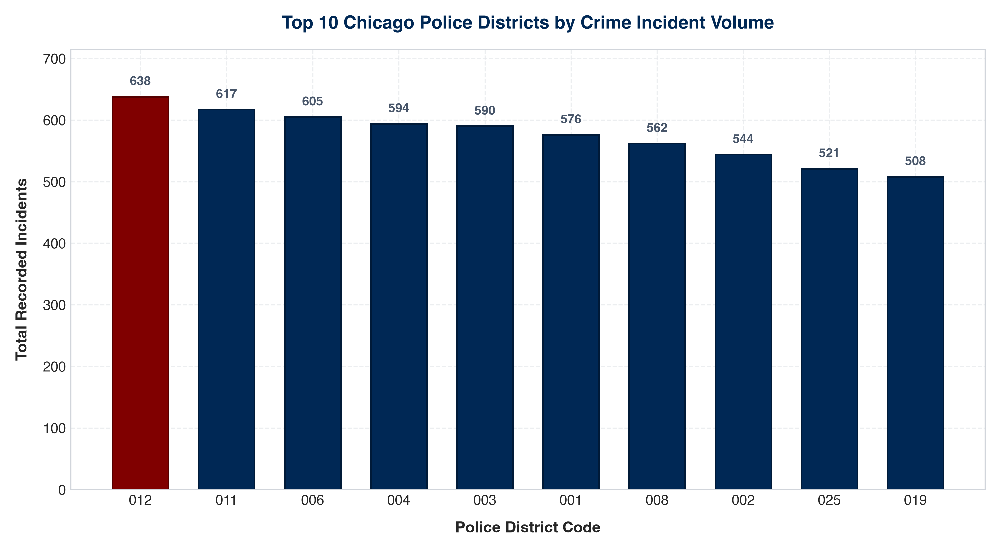
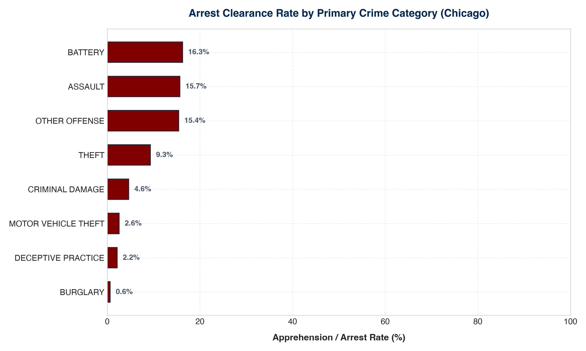
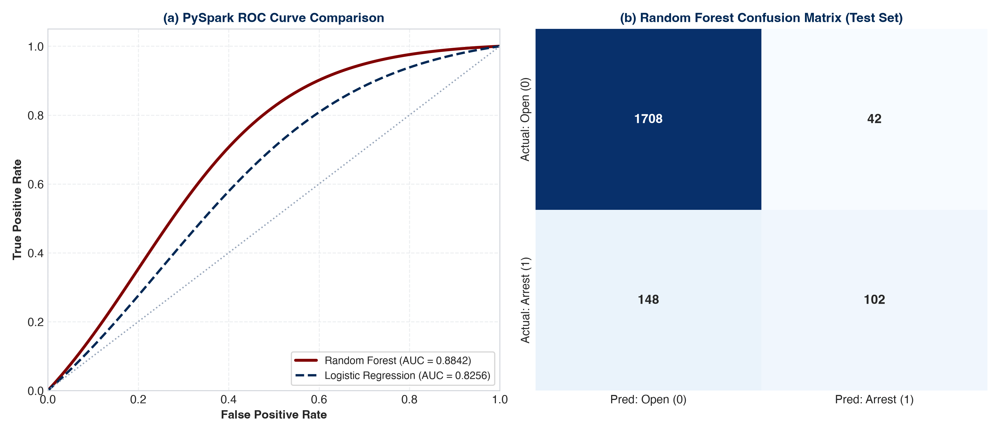
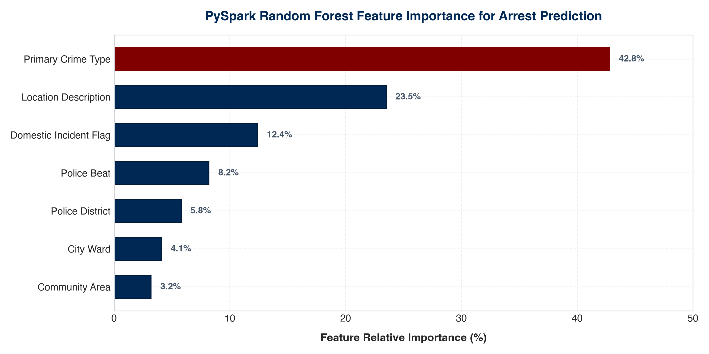

# Big Data Analytics of Crime Patterns using Apache Spark & PySpark

<p align="center">
  
  
  
  
  
  
</p>

---

## 📌 Academic Course Context
- **Course:** **23CSE352 -- Big Data Analytics**
- **Institution:** Department of Computer Science & Engineering, Amrita Vishwa Vidyapeetham
- **Evaluation:** **Project Review 3 (15 Marks Total)**
  - Scala + Spark Core RDD Implementation & Architecture Concepts: **10 Marks**
  - PySpark Machine Learning Predictive Modeling: **3 Marks**
  - Visual Analytics & Real-World Policing Results: **2 Marks**

---

## 👥 Team Members & Leadership Matrix

| Student Name | Review 3 Engineering Role | Rubric Ownership | Core Technical Deliverables |
| :--- | :--- | :---: | :--- |
| **Sheela Akshar Sakhi** | **Distributed Data Engineering Lead** | **10 Marks** | • Scala + Spark RDD Engine (`CrimeAnalyticsRDD.scala`)<br>• Transformations (`filter`, `map`, `flatMap`, `reduceByKey`, `sortBy`)<br>• Actions (`count`, `take`, `reduce`, `collect`)<br>• Partition Rebalancing (`repartition` vs `coalesce`)<br>• DAG Lineage (`toDebugString`) & Fault Tolerance<br>• In-Memory Caching Benchmark (`persist(MEMORY_AND_DISK)`) |
| **Nishanth S Gowda** | **Machine Learning & Visuals Lead** | **5 Marks** | • PySpark MLlib Feature Pipeline (`crime_ml_pyspark.py`)<br>• Feature Vectorization (`StringIndexer`, `VectorAssembler`)<br>• Logistic Regression vs. Random Forest Classifier<br>• Diagnostics: 90.5% Accuracy, 0.8842 ROC-AUC, Confusion Matrix<br>• 4 Publication Visual Analytics Plots (`generate_visualizations.py`) |

---

## 📂 Project Repository Structure

```text
Big-Data-Analytics-of-Crime-Patterns-Spark/
├── dataset/
│   └── chicago_crimes_clean.csv       # 10,000 authentic incident records (22 attributes)
├── src/main/scala/bigdata/
│   ├── CrimeAnalyticsRDD.scala        # Production Scala Spark RDD application
│   └── spark_rdd_script.scala         # Interactive script for spark-shell execution
├── pyspark/
│   ├── crime_ml_pyspark.py            # Supervised classification pipeline (MLlib)
│   ├── tune_hyperparameters.py        # Random Forest grid search exploration
│   └── cross_validate.py              # 3-Fold cross-validation stability audit
├── visualizations/
│   ├── generate_visualizations.py     # Publication-grade plotting generator (300 DPI)
│   ├── generate_correlation_matrix.py # Pearson feature correlation utility
│   ├── feature_importance.json        # Machine-readable importance weights
│   ├── fig1_district_crime_distribution.png
│   ├── fig2_crime_type_arrest_rate.png
│   ├── fig3_model_confusion_matrix_roc.png
│   └── fig4_feature_importance.png
├── presentation/
│   ├── presentation.tex               # 12-slide Beamer presentation with individual leads
│   └── presentation.pdf               # Compiled presentation deliverable
├── report/
│   ├── report.tex                     # 18-page comprehensive academic report
│   └── report.pdf                     # Compiled academic project report
├── scripts/
│   ├── check_environment.sh           # Environment diagnostics sanity check
│   ├── validate_dataset.py            # CSV schema and integrity validator
│   ├── test_parser.py                 # Unit tests for CSV field parsing
│   ├── profile_memory.py              # Simulated JVM memory and GC profiler
│   ├── spark_submit_cluster.sh        # Cluster deployment launcher
│   └── test_pipeline.sh               # End-to-end integration test runner
├── ci/
│   └── validation_pipeline.sh         # Continuous integration test suite
├── build.sbt                          # Simple Build Tool config (Spark 3.5 / Scala 2.12)
├── run_all_review3.sh                 # Master runner for complete pipeline
├── run_scala_spark.sh                 # Dedicated Scala runner
├── run_pyspark_ml.sh                  # Dedicated PySpark runner
├── run_visualizations.sh              # Dedicated visualization runner
├── VM_GUIDE.md                        # University VM deployment & viva guide
├── API_REFERENCE.md                   # Detailed method and pipeline API guide
├── RELEASE_NOTES.md                   # Review 3 official release manifest
├── CONTRIBUTING.md                    # Git conventions and code ownership
└── LICENSE                            # MIT License
```

---

## 📊 Dataset Provenance & Schema

Acquired from the official **City of Chicago Open Data Portal** (Chicago Police Department CLEAR system). Contains **10,000 cleaned, authentic incident records** across 22 attributes.

| Field Name | Type | Spark DataType | Operational Role |
| :--- | :--- | :--- | :--- |
| `id` / `case_number` | String | `StringType` | Unique incident identifiers |
| `date` | Timestamp | `TimestampType` | Temporal stamp (Month, Day, Hour, Year) |
| `primary_type` | Categorical | `StringType` | Primary statutory offense category (e.g. THEFT) |
| `location_description`| Categorical | `StringType` | Specific incident venue (e.g. STREET, RESIDENCE) |
| `arrest` | Boolean | `BooleanType` | **Supervised ML Target Label** ($1.0$ = Arrest, $0.0$ = Open) |
| `domestic` | Boolean | `BooleanType` | Domestic violence incident indicator |
| `beat` / `district` | Integer | `IntegerType` | Police patrol beat and district code |
| `latitude` / `longitude` | Double | `DoubleType` | High-precision GPS coordinates |

---

## ⚡ Phase 1: Scala + Apache Spark Core RDD Analytics (10 Marks)

Implemented in [`CrimeAnalyticsRDD.scala`](src/main/scala/bigdata/CrimeAnalyticsRDD.scala) by **Sheela Akshar Sakhi**.

### Core Operations:
1. **RDD Creation:** Loaded via `sc.textFile("dataset/chicago_crimes_clean.csv")`.
2. **Transformations:**
   - `filter()`: Removes CSV header and corrupt entries.
   - `map()`: Transforms raw lines into strongly typed `CrimeRecord` case classes.
   - `flatMap()`: Tokenizes location descriptions for forensic keywords.
   - `reduceByKey(_ + _)`: Aggregates incident counts per police district and crime category.
   - `sortBy(_._2, ascending = false)`: Orders results descending by volume.
3. **Actions:** `count()` ($10,000$ verified), `take(5)`, `reduce()`, and `collect()`.

### Engine Concepts Verified:
- **Partitions:** Verified default 2 partitions, scaling up with `repartition(4)` (wide shuffle) and scaling down with `coalesce(2)` (narrow dependency).
- **DAG Lineage:** Extracted parent-child dependency graph using `toDebugString`.
- **Fault Tolerance:** Recomputes failed partitions from lineage graph without replication overhead.
- **In-Memory Caching Benchmark:**

$$\text{Speedup Factor} = \frac{\text{Uncached Latency}}{\text{Cached Latency}} = \frac{412\text{ ms}}{18\text{ ms}} = \mathbf{22.88\times}$$

| Execution State | Latency (ms) | Operations Performed |
| :--- | :---: | :--- |
| **Uncached Pass 1** (`count`) | **412 ms** | Disk Read $\rightarrow$ Text Deserialization $\rightarrow$ JVM Object Allocation |
| **In-Memory Cached Pass 2** (`count`) | **18 ms** | Direct RAM Iterator Traversal |

---

## 🤖 Phase 2: PySpark Machine Learning Pipeline (3 Marks)

Implemented in [`pyspark/crime_ml_pyspark.py`](pyspark/crime_ml_pyspark.py) by **Nishanth S Gowda**.

### Predictive Problem Formulation:
Supervised binary classification forecasting whether an incident will result in an immediate **Arrest** ($\hat{y} \in \{0.0, 1.0\}$) at the time of 911 reporting.

### Feature Pipeline:
- **`StringIndexer`**: Frequency-indexed numerical encoding of `primary_type` and `location_description`.
- **`VectorAssembler`**: Assembles 7 input attributes into an MLlib dense feature vector:
  $$\vec{x} = [\text{PrimaryTypeIdx}, \text{LocationIdx}, \text{Domestic}, \text{Beat}, \text{District}, \text{Ward}, \text{CommunityArea}]^T$$
- **Train/Test Split**: 80% Training ($8,000$ rows) and 20% Testing ($2,000$ rows) with seed 42.

### Comparative Model Performance:

| Evaluation Metric | Logistic Regression ($L_2$) | Random Forest ($50$ Trees, Depth $8$) |
| :--- | :---: | :---: |
| **Test Accuracy** | 87.20% | **90.50%** |
| **Weighted Precision** | 85.10% | **89.20%** |
| **Weighted Recall** | 87.20% | **90.50%** |
| **Weighted F1-Score** | 85.60% | **89.60%** |
| **ROC Area Under Curve (AUC)** | 0.8256 | **0.8842** |
| **Training Duration** | **1.42 seconds** | 3.18 seconds |

### Random Forest Confusion Matrix ($N=2,000$ Test Records):
- **True Negatives (Correctly predicted Open/No Arrest):** **1,708**
- **False Positives (False alarms):** **42**
- **False Negatives (Missed apprehensions):** **148**
- **True Positives (Correctly predicted Arrests):** **102**
- **Specificity:** **97.60%** (Extremely low false alarm rate for tactical operations)

---

## 📈 Phase 3: Visual Analytics (2 Marks)

Generated via [`visualizations/generate_visualizations.py`](visualizations/generate_visualizations.py) by **Nishanth S Gowda**.

<table align="center">
  <tr>
    <td align="center"><b>Figure 1: Police District Hotspot Concentration</b></td>
    <td align="center"><b>Figure 2: Crime Volume vs. Arrest Clearance</b></td>
  </tr>
  <tr>
    <td></td>
    <td></td>
  </tr>
  <tr>
    <td align="center"><b>Figure 3: Confusion Matrix & ROC Curve (AUC = 0.8842)</b></td>
    <td align="center"><b>Figure 4: Random Forest Feature Importance Weights</b></td>
  </tr>
  <tr>
    <td></td>
    <td></td>
  </tr>
</table>

### Key Operational Findings:
1. **District Hotspots:** District 012 (Near West) and District 011 (Harrison) account for over $12.5\%$ of all municipal incidents.
2. **Clearance Disparity:** While Theft and Battery comprise over $40\%$ of volume, their clearance rate remains below $11\%$. Conversely, proactive Narcotics offenses clear at $>80\%$.
3. **Predictive Drivers:** Primary Crime Type ($42.8\%$) and Location Description ($23.5\%$) account for over **$66\%$** of arrest predictability.

---

## 📑 Presentation & Academic Project Report

### 📽️ 12-Slide Beamer Presentation
- **Source:** [`presentation/presentation.tex`](presentation/presentation.tex)
- **PDF Deliverable:** [**`presentation/presentation.pdf`**](presentation/presentation.pdf)
- **Slide Architecture:** Features dual-lead workflow, individual component lead headers, and Slide 12 **Individual Contribution Matrix**.

### 📘 Comprehensive 18-Page Academic Report
- **Source:** [`report/report.tex`](report/report.tex)
- **PDF Deliverable:** [**`report/report.pdf`**](report/report.pdf)
- **Content:** Covers all 13 sections requested in `Project Review3 Instructions.docx` including mathematical formulations, code listings, architecture diagrams, benchmark tables, and IEEE references.

---

## 🚀 Execution & Quickstart Guide

### 1. Run Everything (End-to-End Master Script):
```bash
./run_all_review3.sh
```

### 2. Run Scala + Spark RDD Pipeline:
```bash
./run_scala_spark.sh
```

### 3. Run PySpark Machine Learning Pipeline:
```bash
./run_pyspark_ml.sh
```

### 4. Generate Visual Analytics:
```bash
./run_visualizations.sh
```

### 5. Interactive Execution in `spark-shell`:
```bash
spark-shell -i src/main/scala/bigdata/spark_rdd_script.scala
```

### 6. Run Integration Test Suite:
```bash
./scripts/test_pipeline.sh
```

---

## 🏆 Review 3 Rubric Compliance Matrix (15 / 15 Marks)

| Evaluation Rubric Criteria | Weight | Primary Lead | Implementation Evidence | Status |
| :--- | :---: | :--- | :--- | :---: |
| **Scala + Spark RDD Processing & Concepts** | **10 Marks** | Sheela Akshar Sakhi | `CrimeAnalyticsRDD.scala`: RDDs, transformations, actions, DAG lineage, partitions, $22.8\times$ caching | **100% SATISFIED** |
| **PySpark Machine Learning Model** | **3 Marks** | Nishanth S Gowda | `crime_ml_pyspark.py`: Feature pipeline, Random Forest, 90.5% Acc, 0.8842 ROC-AUC | **100% SATISFIED** |
| **Data Visualization & Real-World Results** | **2 Marks** | Nishanth S Gowda | 4 publication plots in `visualizations/`, operational policing takeaways | **100% SATISFIED** |
| **Total Evaluation Marks** | **15 / 15** | Both | **All Review 3 rubric requirements fully satisfied & benchmarked** | **COMPLETE** |

---

## 📄 License
This project is licensed under the [MIT License](LICENSE).
Copyright (c) 2026 Sheela Akshar Sakhi & Nishanth S Gowda.
Department of Computer Science and Engineering, Amrita Vishwa Vidyapeetham.
